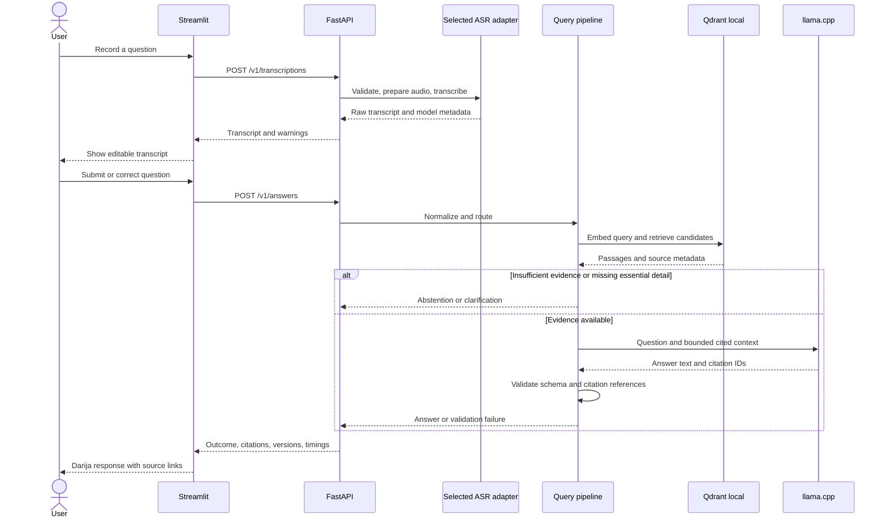

# Lmaana Assistant — architecture design

Status: proposed implementation design · 3 October 2026

Build a local Darija voice assistant as a **modular Python application**: a Streamlit interface, a FastAPI backend, replaceable ASR adapters, a versioned document index, and a local Qwen generation server. Keep document ingestion and benchmarking separate from the user request path.

Implementation update: the repository now includes a text prototype with ingestion, persistent Qdrant retrieval, FastAPI, a Streamlit interface, and tested model-adapter contracts. The default lexical/excerpt profile runs without ML weights. A source-currency gate excludes historical, unverified and expired references before generation. The registration section of the DGI 2026 guide has a scope-limited review, due for renewal on 2026-11-02; it yields French source excerpts while the review is valid. Its cross-page conditions stay in one chunk. The other two references remain withheld. See [source quality](source-quality.md). Neural inference and speech transcription have not yet been validated with real models. The remaining sections describe the target architecture; consult the README for executable setup instructions.

## 1. Scope and hardware

The first version accepts a short voice recording or typed question, retrieves Moroccan public-service documentation, and returns a Darija text answer with source links and page or section references. The user can correct the transcript before submitting it. Speech playback through TTS is a later feature.

Use auto-entrepreneur registration as the provisional first topic, following the original example. Start with 20–50 reviewed official pages or PDFs; expand to other procedures only after evaluating this slice. These are corpus targets, not documents already collected.

Local hardware inspection found an **NVIDIA GeForce RTX 5070 Laptop GPU, 8,151 MiB VRAM**, and approximately **31.4 GiB usable RAM**; the user reports 32 GB DDR5. The design targets Windows and this 8 GB GPU. The selected ASR is **Lmaana/lmaana-2.4**, a native fairseq2/OmniASR CTC checkpoint. Its runtime compatibility and memory footprint still need validation. See the [pinned integration target](lmaana-2.4-integration.md).

## 2. System overview


The editable diagram source is [system.mmd](diagrams/system.mmd). Arrows show requests, results, and ingestion writes. FastAPI owns the application pipeline; Qdrant local storage is accessed through the retrieval adapter inside the same process. The offline ingestion CLI opens that storage only while the API is stopped.

### Technology decisions

| Concern | MVP choice | Reason and boundary |
| --- | --- | --- |
| Interface | Streamlit | Record audio, edit transcripts, display right-to-left answers and citations quickly. [Microphone widget documentation](https://docs.streamlit.io/develop/api-reference/widgets/st.audio_input). |
| Application | FastAPI with typed request/response models | One backend owns orchestration, model adapters, validation, and tracing. The UI calls HTTP endpoints and never loads models. |
| ASR | Lmaana/lmaana-2.4 primary; Whisper-large-v3-turbo comparison | Integrate the selected native checkpoint first, then compare using identical audio and scoring rules. [Lmaana model card](https://huggingface.co/Lmaana/lmaana-2.4), [Whisper model card](https://huggingface.co/openai/whisper-large-v3-turbo). |
| Normalization and routing | Versioned Python rules and alias dictionary | Preserve names, numbers, negation, and French terms; retain the original transcript. Unknown intent can still proceed to retrieval. |
| Embeddings | Qwen3-Embedding-0.6B, initially on CPU | Start with 1,024 dimensions and the documented query instruction format; evaluate Darija-to-Arabic/French retrieval locally. [Embedding model card](https://huggingface.co/Qwen/Qwen3-Embedding-0.6B). |
| Retrieval | Qdrant client in persistent local mode | Store vectors, source text, and metadata together. One process owns the storage directory. Move to server mode when concurrent ingestion or multiple workers become necessary. [Qdrant client documentation](https://github.com/qdrant/qdrant-client#local-mode). |
| Generation | Qwen3-4B GGUF, Q4_K_M, through llama.cpp | Start with a 4,096-token context and non-thinking output. The published artifact is about 2.5 GB; runtime memory also includes caches and buffers. [Qwen model card](https://huggingface.co/Qwen/Qwen3-4B-GGUF). |
| Orchestration | Explicit Python pipeline and typed interfaces | The MVP is a short, bounded sequence. Introduce LangGraph if resumable branching or multi-turn workflows justify it; framework integration stays behind these interfaces. |
| Observability | Structured JSON logs and benchmark JSONL | Capture stage timings, versions, outcome, and resource use. Prometheus or experiment dashboards can be added later. |

React, hybrid lexical/dense retrieval, a reranker, LangGraph, Qdrant server, and TTS are extension points. None is required to deliver the first measured voice-to-answer path.

## 3. Online request flow



Typed questions begin at `POST /v1/answers`. Splitting transcription from answering makes ASR errors visible and lets retrieval be evaluated independently. The first UI uses submit-and-wait requests; token streaming and multi-turn history come later.

### Audio and ASR

- Accept WAV recordings first, at most 30 seconds and 10 MiB. Inspect the decoded format and duration, not just the extension; reject malformed, silent, or oversized input.
- Convert to mono and the selected model's required sample rate. Use 16 kHz for the Whisper baseline; confirm Lmaana's preprocessing contract when its checkpoint is available.
- Transcribe in the spoken language, retaining code-switching. Preserve the raw result and any adapter-provided segment timestamps. Evaluate language hints on the development set.
- Return `confidence: null` when no calibrated confidence exists. Token log probabilities or no-speech scores are diagnostic signals, not probabilities that a transcript is correct.
- Keep audio transient and delete temporary files after success, failure, or cancellation. Persist research recordings only through an explicit opt-in workflow.

### Darija normalization and intent

Keep separate `raw_text`, `effective_text` (after user correction), and `normalized_text` fields. Apply Unicode normalization, whitespace cleanup, and reviewed spelling aliases to the retrieval representation. Do not replace the raw transcript or silently translate the user's question.

Preserve `auto-entrepreneur`, organization names, dates, fees, and negation. Add Arabic/French aliases to retrieval queries without removing original terms. Avoid blanket transliteration of Latin text; Arabizi support needs its own tested rules.

Use a small initial intent set: `required_documents`, `eligibility`, `procedure_steps`, `fees`, `deadlines`, and `unknown`. Intent helps organize the answer; use hard metadata filters only for explicit user constraints or confirmed topic choices. An uncertain classifier must not discard relevant documents.

### Retrieval and answer generation

1. Embed the effective normalized query using a versioned query instruction. Query vectors and document vectors must share model revision, dimension, normalization, and distance convention. Documents follow the model's document encoding recipe, without the query instruction.
2. Retrieve 10 dense candidates from the selected corpus release. Deduplicate overlapping passages and select up to four passages within the generation token budget. These are starting values to tune on development data.
3. Check whether the passages cover the requested facts. Calibrate similarity thresholds on labeled data; similarity is not a confidence probability. Ask for a missing essential detail, or abstain when the available evidence is insufficient.
4. Build context from immutable chunk IDs, original excerpts, and source metadata. Documents are reference material, never instructions for the assistant. Do not expose tools or execute actions from retrieved text.
5. Ask Qwen for a concise Arabic-script Darija answer that preserves useful French terminology. Require citation IDs for factual claims. Use structured output and a fixed output limit, initially 512 tokens.
6. Reject unknown citation IDs, missing references on factual answers, and malformed responses. Resolve URLs and page references from stored metadata, not generated URLs. Allow one bounded regeneration attempt; if it fails, return an abstention with a readable explanation.

Citation validation confirms that a reference exists; it does **not** prove that the cited text supports every claim. Human evaluation measures support and completeness. Add an evidence verifier only if its added latency and reliability are measured.

The full serialized prompt, retrieved passages, question, and reserved output must fit 4,096 tokens, measured with the generator's tokenizer. Trim low-priority passages first. Report contradictory or outdated evidence rather than combining it into a confident procedure.

## 4. Document ingestion and provenance


Ingestion is an operator CLI workflow. Stop the API before opening local Qdrant storage for an update. Build a new collection, validate it, then update the active release manifest and restart. Keep the previous release for rollback; do not rewrite the active corpus in place. Serving and ingestion must never share the same embedded storage directory concurrently.

For each approved source, record publisher, canonical URL, title, language, topic, jurisdiction, retrieval time, content hash, extraction method, and reuse status. Record publication/effective dates only when stated; a download timestamp does not establish that a procedure is current.

Extract HTML structure and PDF page boundaries. Quarantine empty or garbled Arabic extraction for review; OCR is a later ingestion adapter, not silently accepted text. Preserve lists of requirements, fee tables, and headings. Start with approximately 350 embedding-token chunks and 50-token overlap, then evaluate. Keep original excerpts for citations and normalized text separately for search.

Use deterministic document and chunk identities derived from source identity, content hash, chunker version, and chunk position. Map these to Qdrant-compatible UUID point IDs. Unchanged inputs should reproduce the same IDs. Revised or withdrawn pages produce a new release with explicit supersession metadata.

Each release manifest pins the source set, embedding model revision, vector dimension, distance metric, query instruction version, normalization rules, and chunker version. A change to document encoding or chunking requires a new index. API startup must reject incompatible index/model settings. Query-only changes still create a new experiment configuration and require evaluation.

## 5. Component contracts and proposed repository layout

The Python import package has been renamed to `lmaana_assistant`. Imports, configuration, and tests use this name. The following tree remains the full target; see the README for the modules implemented so far.

```text
apps/
  streamlit_app.py             recording, transcript editing, answer display
src/lmaana_assistant/
  api/                        app lifecycle, routes, request validation
  contracts.py                shared typed inputs, results, adapter protocols
  pipeline.py                 bounded query orchestration
  audio/                      decoding, resampling, silence checks
  asr/                        base interface, lmaana adapter, whisper adapter
  normalization/              conservative rules and terminology aliases
  intent/                     topic and requested-information routing
  ingestion/                  manifest loading, fetching, parsing, chunking
  retrieval/                  embeddings, Qdrant adapter, passage selection
  generation/                 llama.cpp client, prompt, citation validation
  evaluation/                 ASR, retrieval, answer quality, latency runners
  observability/              request IDs and stage timing
  config.py                   validated settings and model/index versions
configs/                      versioned non-secret settings and aliases
docs/                         architecture and evaluation protocols
tests/                        unit, contract, integration, regression cases
data/                         ignored corpus releases and evaluation audio
models/                       local model cache, excluded from Git
```

This is the target layout, not a claim that these modules already exist. Add the model cache and all generated or sensitive data paths to ignore rules when implementing them.

| Interface | Input → output | Ownership rule |
| --- | --- | --- |
| `ASRProvider.transcribe` | Prepared audio → `TranscriptResult` | Owns model-specific preprocessing, inference, and metadata. |
| `QueryProcessor.process` | Effective text → `ProcessedQuery` | Preserves original text, records transformations and intent. |
| `Embedder` | Queries or documents → vectors | Uses distinct query/document recipes and exposes a version fingerprint. |
| `Retriever.search` | Processed query and filters → ranked `EvidenceChunk` records | Returns source provenance and the corpus release ID. |
| `AnswerGenerator.generate` | Question and evidence → `GeneratedAnswer` | Emits text, outcome, and citation IDs, never trusted source URLs. |
| `CitationValidator.validate` | Generated answer and evidence → validation result | Checks reference membership and output structure. |

`pipeline.py` coordinates these interfaces; adapters do not import UI or HTTP route code. Evaluation runners call the same contracts as the application so benchmarks measure the deployed logic.

## 6. API and data contracts

| Planned endpoint | Request | Response |
| --- | --- | --- |
| `GET /health/live` | None | Process is alive; no heavy model inference. |
| `GET /health/ready` | None | Required configured dependencies are loaded and compatible; otherwise 503. |
| `POST /v1/transcriptions` | Multipart WAV | Raw transcript, transcription ID, model revision, audio duration, warnings, timings. |
| `POST /v1/answers` | JSON question and optional transcription ID | Outcome, answer or clarification, citations, corpus/model versions, timings. |

The answer request requires `question`; an optional `transcription_id` links timing and provenance. Keep a bounded in-memory transcription record for ten minutes with raw transcript and timings, but no audio. Expired IDs return a clear error; the user can resubmit the question as text. When a supplied question differs from the linked transcript, record it as a user correction.

Use `answered`, `clarification_required`, and `insufficient_evidence` as semantic outcomes with HTTP 200. The development profile adds `source_excerpts` to distinguish verbatim retrieval from a generated answer, and `verification_required` when only relevant unapproved references are available. Withheld references are separate from answer citations. Use 413 for size limits, 415 for unsupported audio, 422 for invalid input, 429 with `Retry-After` when inference is busy, 503 for missing dependencies, and 504 for an inference timeout. Do not label outages as missing evidence.

Core records:

| Record | Required fields |
| --- | --- |
| `TranscriptResult` | ID, raw text, model ID/revision, duration, warnings, nullable confidence, timings |
| `ProcessedQuery` | Effective text, normalized text, aliases, intent, transformations, normalization version |
| `EvidenceChunk` | Chunk ID, source ID, original text, title, URL, language, page/section, retrieved-at timestamp, content hash, release ID, ranking score |
| `AnswerResponse` | Request ID, semantic outcome, answer/clarification text, resolved citations, model/index/config versions, stage timings |
| `BenchmarkRun` | Dataset and split revisions, code commit, model/runtime revisions, precision, prompts, hardware, per-item outputs, aggregate metrics |

In an example question such as `شنو الوثائق لي خاصني باش ندير auto-entrepreneur؟`, the system preserves the French term, identifies a likely required-documents intent, retrieves the relevant approved procedure, and cites its sections. Until such a source is indexed, the correct behavior is an insufficient-evidence response—not a fabricated checklist.

## 7. Deployment on the RTX 5070 laptop

Run three local processes: Streamlit on `127.0.0.1:8501`, one FastAPI worker on `127.0.0.1:8000`, and llama.cpp on `127.0.0.1:8080`. Qdrant local mode runs inside the API process. Ingestion and benchmark commands run separately. No cloud inference or Docker is required for the MVP.

| Resource | Initial placement | Constraint |
| --- | --- | --- |
| Selected ASR model | GPU when supported by its runtime | Only one ASR checkpoint loaded. Measure the specific Lmaana checkpoint before enabling it. |
| Qwen3-4B Q4_K_M | GPU/CPU split, tuned after profiling | One generation slot; 4,096-token context and bounded output. |
| Qwen3-Embedding-0.6B | CPU and system RAM | Keep embeddings off the shared GPU during serving. |
| Retrieval, parsing, routing | CPU and system RAM | Small reviewed corpus first; monitor growth. |

llama.cpp supports quantized GPU/CPU inference, configurable GPU layers, context size, and structured JSON responses. These capabilities support this placement plan; they do not establish its measured performance. [Server documentation](https://github.com/ggml-org/llama.cpp/blob/master/tools/server/README.md).

Profile ASR and generation alone, then together at maximum supported input. Keep at least 1 GiB of observed VRAM headroom as an initial operating target. A shared API inference semaphore serializes GPU work; **serialization does not free resident model weights**. If their combined memory does not fit, reduce LLM GPU offload and batch sizes, then select a measured CPU or explicit model-unloading profile. Report any fallback and include reload time in latency.

With Lmaana 2.4 selected, begin speech profiling with Qwen generation on CPU. Its 3B ASR architecture makes simultaneous GPU residency an open measurement question, not the assumed default. Keep the fairseq2 runtime separate from the text backend if native Windows dependencies require a Linux/WSL worker.

Keep the LLM endpoint private to the backend, use one backend worker, and return a busy response instead of creating an unbounded queue. Run blocking inference outside the API event loop. Give operations explicit timeouts and cancellation cleanup; retain the inference slot until cancelled computation has actually stopped. Reset unhealthy model state before accepting more work.

Start with native Windows environments. Before downloading full model weights, verify that the selected PyTorch/CUDA and llama.cpp builds can execute a small GPU workload on this card. Pin working runtime versions after the smoke test; a detected GPU is not proof of framework compatibility.

For a future shared deployment, add authentication, TLS, upload limits, rate limits, and a private Qdrant server. Multiple API workers require coordinated GPU scheduling and server-backed storage. Local embedded storage is not the production concurrency design.

## 8. Evaluation and release criteria

Maintain three separately versioned evaluation sets: a human-reviewed speech set, retrieval questions with relevant source/chunk IDs, and answer questions with expected claims and supporting passages. Include Darija, French code-switching, noisy speech, unanswerable requests, ambiguous questions, and conflicting source versions.

MoulSot-Full is an additional ASR benchmark source. Its card describes a roughly 1,500-hour pool, an approximately 80-hour transcribed subset, and automatically generated transcripts. Audit the selected configuration and examples; do not label these references human gold. [Dataset card](https://huggingface.co/datasets/atlasia/MoulSot-Full).

Split audio by speaker where reliable IDs exist, otherwise by source video/channel; report the remaining leakage risk. Compare the Lmaana training manifest against held-out IDs before reporting generalization. If training overlap is unknown, label that limitation. Keep prompt and threshold tuning on development data, freeze the test set, and manually review test references independently of candidate outputs.

| Layer | Measurements | Comparison or acceptance rule |
| --- | --- | --- |
| ASR | Raw and normalized WER/CER, entity/number errors, real-time factor | Compare Lmaana and Whisper on the same clips; publish both normalization rules and code-switching slices. |
| Retrieval | Recall@1/5/10 and MRR@10 | Compare dense retrieval with a lexical baseline; initial development goal is Recall@5 ≥ 0.85 on answerable queries. |
| Grounding | Claim support, citation precision and completeness | Human review of Arabic/French evidence; initial goal ≥ 95% supported factual claims, with 100% valid citation references. |
| Answer usefulness | Task completeness and natural Darija, each 1–5 | Bilingual human rubric; fluent wording alone does not pass an incorrect answer. |
| Abstention | Precision and recall for unanswerable cases, plus answer coverage | Check both fabricated answers and unnecessary refusals; report the tradeoff. |
| Latency | Per-stage and total p50/p95, cold vs warm, peak RAM/VRAM | Initial experiment goal: warm p95 ≤ 15 seconds for clips ≤ 10 seconds and answers ≤ 120 words; validate before committing to an SLA. |

All numeric goals are provisional acceptance targets, not observed results. Publish sample counts and uncertainty alongside aggregate scores. For ASR, bootstrap by speaker or source group where possible. For retrieval, calculate recall over all labeled relevant items at a declared granularity; MRR uses the first relevant rank and zero for misses. Keep unanswerable queries out of recall denominators and evaluate them separately.

Measure processing latency from completed upload through final validated response, excluding recording time and user editing time. Link the two API calls to sum their processing durations; report wall-clock interaction time separately. Cold startup and model reloads receive separate measurements. Record audio duration and generated token count with each result.

Run these ablations while holding the downstream pipeline fixed:

1. Human transcript → retrieval → answer, to establish the text-path baseline.
2. Lmaana transcript versus Whisper transcript → the same retrieval and generator.
3. Normalization enabled versus disabled, including entity-preservation checks.
4. Dense retrieval versus lexical retrieval, then optional hybrid fusion or reranking.

Unit and contract tests cover text preservation, chunk IDs, index compatibility, and citation membership. Integration tests use a tiny local fixture corpus and fake model adapters. Hardware smoke tests cover real model loading, busy/timeout handling, silence, oversized audio, and recovery after GPU failure. No current benchmark result is implied by the repository's existing configuration test.

## 9. Privacy, provenance, and observability

Log request IDs, stage durations, status codes, model revisions, corpus release, and resource peaks by default. Keep transcripts, full prompts, and recordings out of normal logs. Raw corpus text and model files stay outside Git; commit manifests and redistributable test fixtures.

Accept ingestion only from an operator-reviewed source manifest. Restrict fetches to approved HTTPS sources, validate redirect destinations, and block loopback/private-network targets. Preserve source reuse information and review dataset/model terms before redistribution.

Display the source publisher, title, page/section, and retrieval date beside answers. A citation or recent fetch does not guarantee current rules; stale, superseded, and contradictory material must be identifiable. This is an information assistant: the MVP does not submit administrative applications or make eligibility decisions for the user.

## 10. Implementation order

| Milestone | Deliverable | Exit condition |
| --- | --- | --- |
| 1. Text RAG | Reviewed source manifest, ingestion CLI, Qdrant index, Qwen client, `/v1/answers` | A source-backed answer and an insufficient-evidence case work with reproducible citations. |
| 2. Voice input | Audio validation, Lmaana 2.4 adapter, `/v1/transcriptions`, Streamlit recording and editing | Spoken question → editable transcript → cited Darija answer runs locally. |
| 3. ASR comparison | Whisper comparison adapter, dataset audit, paired ASR and downstream experiments | WER/CER, retrieval impact, latency, and memory are reported for both models. |
| 4. Retrieval and UX refinement | Darija aliases, lexical/hybrid ablations, better clarification | Changes pass the frozen regression set and improve measured behavior. |
| 5. Optional expansion | React, TTS, multi-turn workflows, shared deployment | Add each only with its own quality, resource, and operational checks. |

Before milestone 2, obtain access to the pinned Lmaana 2.4 checkpoint, validate its native runtime and preprocessing recipe, and measure its inference footprint. Before benchmarking, audit training overlap with evaluation audio. Before choosing the serving profile, benchmark model coexistence on the observed 8 GB GPU.
